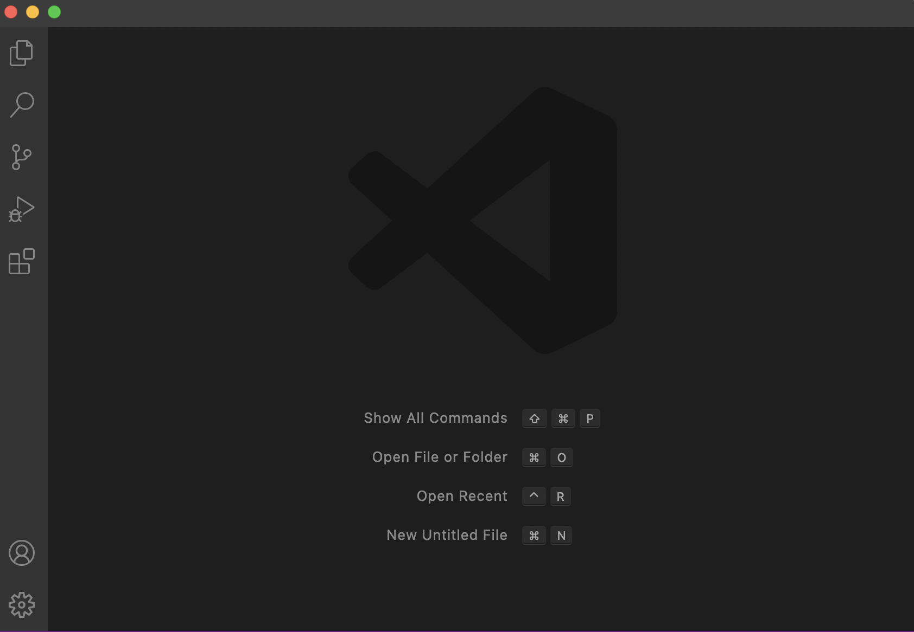
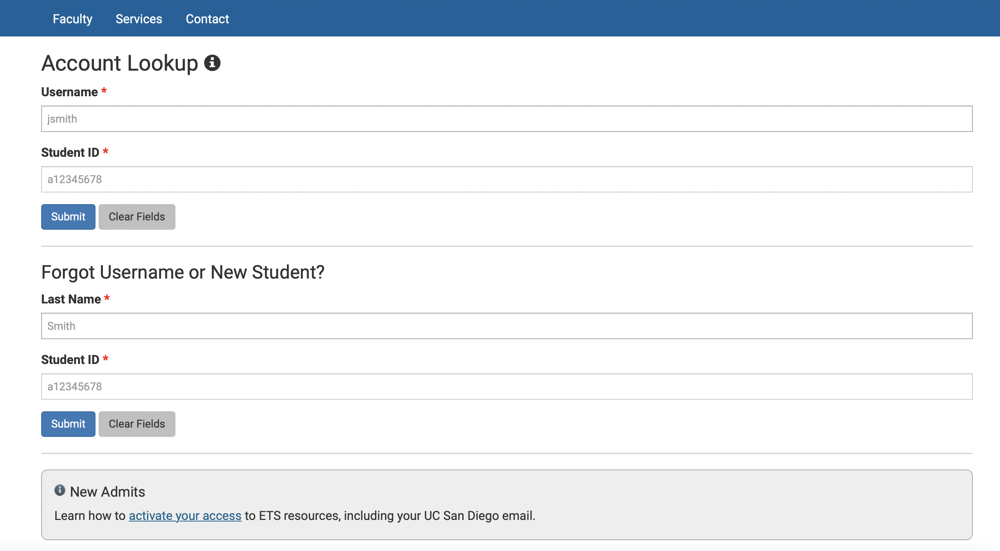
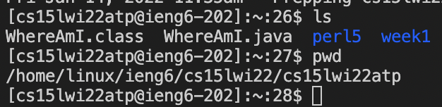
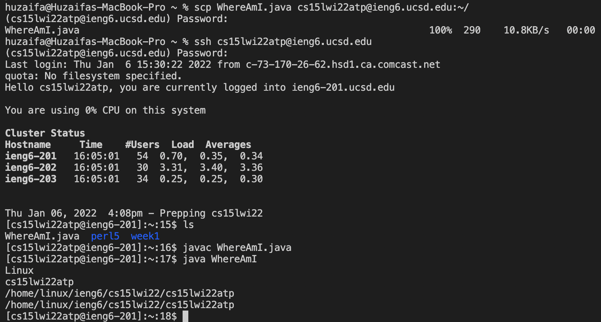
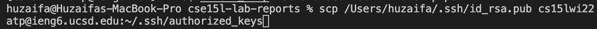
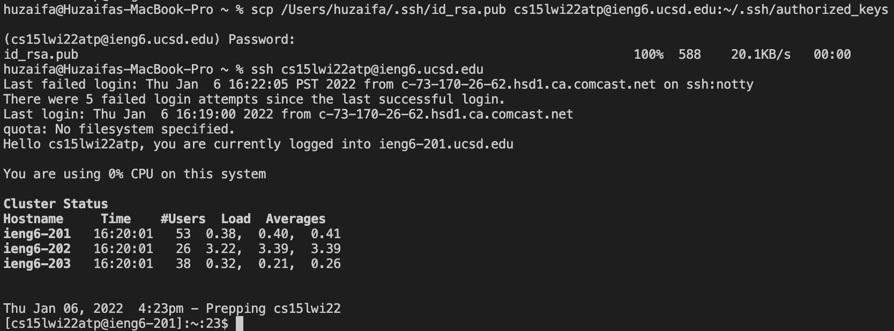
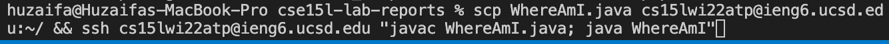

# Remote Access

## 1. Install VScode

Navigate to [VScode](https://code.visualstudio.com/) to get started with the install.

Download and install the version of VSCode appropriate for your OS (Windows/Mac OS/etc..)

Once the installation is complete, launch VScode and you should see something similar to the following image.



That's it, you're finished with installing VScode.

## 2. Connecting Remotely

Please navigate to the following website to lookup your account.

[account lookup](https://sdacs.ucsd.edu/~icc/index.php)



The page should look like this. Follow the prompts until you find your account.

It should be similar to cs15lwi22zz@ieng6.ucsd.edu where the 'zz' characters are your unique to your account.

In your VScode terminal, run the following command:

```ssh cs15lwi22zz@ieng6.ucsd.edu```

Make sure to replace the 'zz' with your unique account characters.

Select 'yes' on the following prompt and then enter your UCSD password.

That's it! You should now be connected remotely!

## 3. Running Commands

Now that we're connected remotely to the server, we can now issue commands.

Try running commands like 'pwd' which shows the current working directory, and 'ls' which lists files in the current directory.

You should get something like this:



That's all there is to it! You've now successfully run commands on the server.

## 4. Moving Files with scp

At some point you may have the need to move files from your computer to the server (or other way around). We can do this using the ```scp``` command. Make sure to begin using the command from the client and not the server.

Say you want to move a file called 'WhereAmI.java' from your computer in the current working directory to the server. You would run the ```scp``` command like below to do so.



Notice that once the file is on the server, we will be able to interact with it using commands on the server. That's how to move files from your computer (client) to the server using the 'scp' command.

## 5. Setting an SSH Key.

We can get around having to input a password every time we want to login to our server using SSH Keys. Using the command ```ssh-keygen``` on the client computer (your computer), we generate a public and private key. The public key should be put on a specified location on the server while the private key is put on the client computer in a specified location.

The location to put the public key on the remote server is ```~/.ssh/authorized_keys```.

The command we want to run to put the public key in the correct location should look something like this.



Since the key is not yet put on the server, we will be once again prompted for the password.

Once we finish with this step we're all done with setting up the ssh key! We should no longer need a password to connect to the server. An example of what the process will now look like is below.



## 6. Optimizing Remote Running

Now that we have the ssh-key setup, we can do some cool tricks that make working on a remote server even more convenient!

For example, to connect to the server and run a command and logout immediately from the server we can do the following:

```ssh cs15lwi22@ieng6.ucsd.edu "command"```

Where command is the command we want to run.

We can even run multiple commands in a single line.

For example:



In this example, we first copy the file 'WhereAmI.java' to the remote server in the home directory. After that command is done executing, we then run 'javac WhereAmI.java' and 'java WhereAmI' one after another. This should also not prompt us to put in a password since we set up the ssh-key.

And done!

So if we were to make a local edit to the WhereAmI.java file and had it saved to our client and we wanted to send it to the server, compile the java file, and then run it, assuming we ran the command in the screenshot just before, it would take a total of 2 keystrokes to accomplish this. Up arrow once in terminal which would bring back the last command executed, and then the 'Enter' key which would execute the command.

That concludes this short tutorial of getting familiar with remote access to a server.
