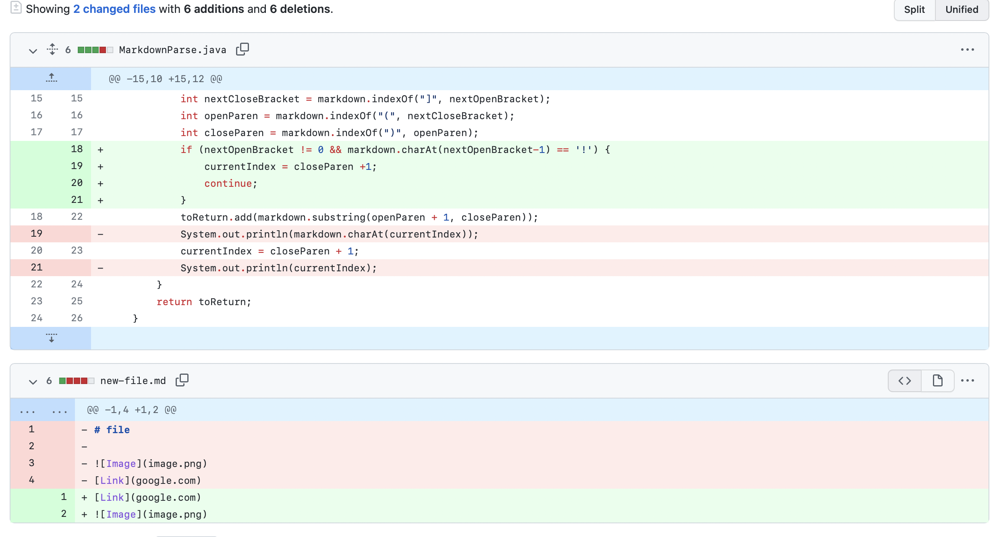
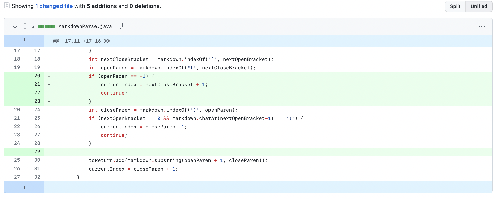
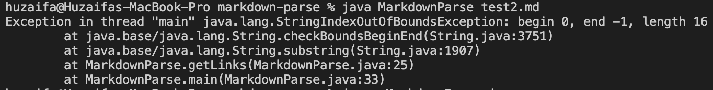

# Week 2 Lab Report

## Code Changes

## 1. Images

1. Screenshot

2. Link to file

Here is the file that prompted the change:

[Link](https://github.com/mhuzaifa125/markdown-parse/blob/main/image.md)

3. The symptom of the bug was that the output was also including images.

4. The reason the output would include images was because we were looking for open and close brackts, and then looking for whatever was in the parenthesis following the open and close brackets. This was an issue since images are also included in a similar format with the exception being theyre is an exclamation mark before the open bracket. So that's why if a file was given as input that included images, the output would also include the image name or link.

## 2. Link on first line

1. Screenshot

2. Link to file
[Link](https://github.com/mhuzaifa125/markdown-parse/blob/main/link-first.md)

3. The symptom of this bug was an error when running the file because of trying to access the -1 index of a string.

4. The error was happening because of our fix for files with images would look to see if there was an exclamation mark before the opening bracket. This means that if there was a link on the first line, then there would be an opening bracket as the first character in the string. However, we would then access the -1 index to see if there an exclamation mark there and that would cause the error.

## 3. Links without parentheses

1. Screenshot

2. Link to file
[Link](https://github.com/mhuzaifa125/markdown-parse/blob/main/test2.md)

3. Here is what the symptom of the bug looked like:

4. This would happen if we got a file that included a link without parentheses. Since we would have variables that would look for open and close parentheses, both of our variables would end up as -1. We would then try to access the string at these indexes while adding 1 to the open parenthesis (to get the value after the parenthesis) and leaving the closing parenthesis location as is. That would give the error as shown in the image in part 3.