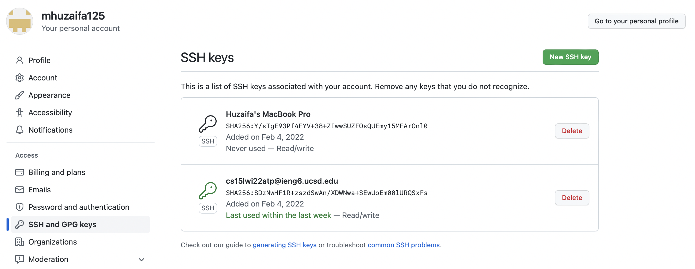
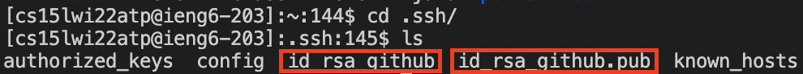

# Week 2 Lab Report

## Github Access from ieng6

The public key is stored on Github in ```Settings > SSH and GPG keys```



On the user account on ieng6, the ssh keys are stored in the ```.ssh``` directory in the home folder of the user account.



The private key is the file without the extension of pub.

## Pushing Edits from ieng6

This line was added from ieng6
