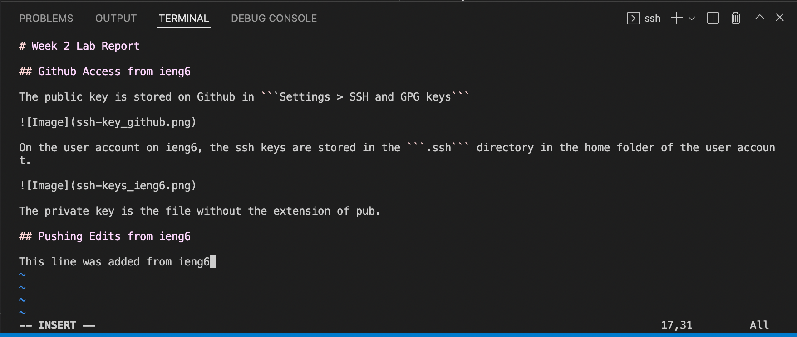
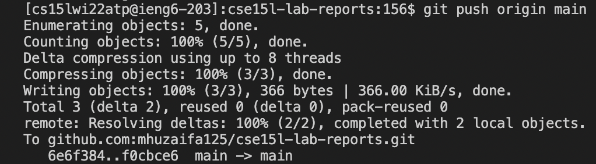

# Week 2 Lab Report

## Github Access from ieng6

The public key is stored on Github in ```Settings > SSH and GPG keys```


On the user account on ieng6, the ssh keys are stored in the ```.ssh``` directory in the home folder of the user account.


The private key is the file without the extension of pub.

## Pushing Edits from ieng6

This line was added from ieng6

The previous line was added from ieng6 as shown below



After saving and running ```git add lab-report-3-week-6.md``` followed by ```git commit -m "Commiting a change from ieng6"``` we are able to push the changes as below.

