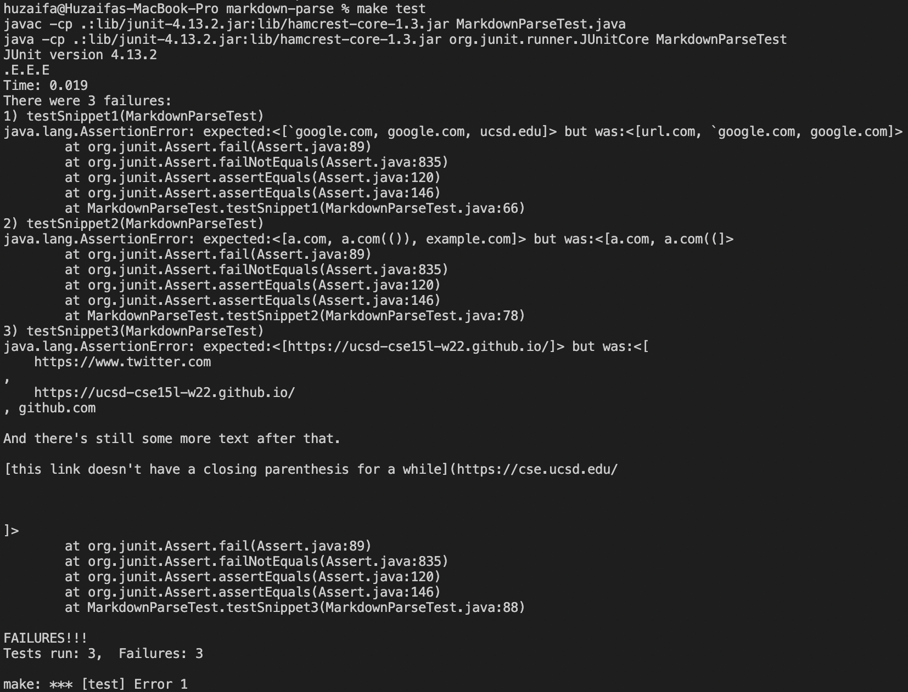
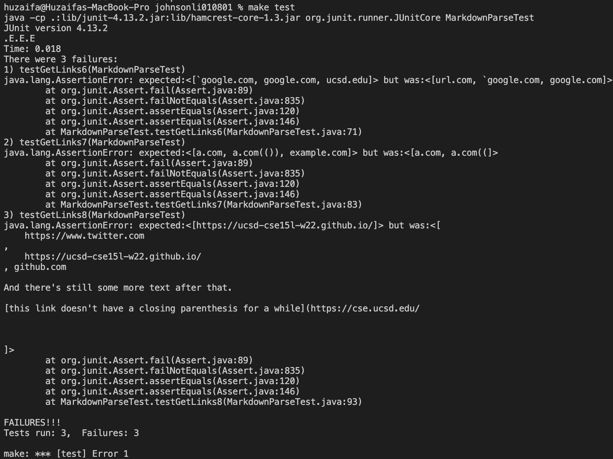

# Week 4 Lab Report

## Links

[My Markdown Repository](https://github.com/mhuzaifa125/markdown-parse)

[Johnson Li's Repository](https://github.com/johnsonli010801/markdown-parse)

## Snippet Test results

### My MarkdownParse:

All 3 tests fail. The output for the tests can be seen in the screenshot at lines beginning with "1)", "2)", and "3)" corresponding to each snippet test.

1. Snippet 1

It seems like we want to ignore the link between the parentheses if one of the brackets is enclosed between backticks. I think this can be implemented with more than 10 lines of code. First, we would want to hold the indices of the '\n' character and make sure they are on the same line as the link. Then we can check to see that the location of the open and closed brackets are not in between any pair of backticks. For this we look for two backticks from the previous '\n' character and make sure they are both before the '\n' at the end of the line. Then we see if the brackets are in between. If not, we try to get the next set of backticks. If we find no other backticks, then we know that the brackets are not enclosed in backticks. If we ever find 1 backtick where it is before one of the brackets and the next one is on another line, we can ignore all links between them.

2. Snippet 2

I think the code to correctly identify all links for this snippet and related cases can be implemented but it will take more than 10 lines of code. So for this, we want to get links that have nested parentheses, nested brackets, and nested escaped brackets. So to make this work we find the first bracket as normal, and then we want to find the last occurrence of a closing bracket. Similarly for the links, we find the first open parenthesis as normal, and then we find the last occurrence of a closed parenthesis and whatever is in between those two is a link. The problem for this approach is that now we ignore nested links. To include this we would go over our 10 lines limit.

3. Snippet 3

For snippet 3, it looks like it's valid for the link to be on multiple lines due to length, however line breaks should not be in between. This can be done in less than 10 lines. We now just want to get the open and close brackets and check to see if there are any occurrence of double '\n' in between. If there are, we drop those two brackets and move on. If we don't find the double new line characters, then we can do the same for open and close parentheses. If there are double new lines in between the open and close parentheses, then we drop that link and move on as well.

### Johnson Li's MarkdownParse:

All 3 tests fail. The output for the tests can be seen in the screenshot at lines beginning with "1)", "2)", and "3)" corresponding to each snippet test.

1. Snippet 1

It seems like we want to ignore the link between the parentheses if one of the brackets is enclosed between backticks. I think this can be implemented with more than 10 lines of code. First, we would want to hold the indices of the '\n' character and make sure they are on the same line as the link. Then we can check to see that the location of the open and closed brackets are not in between any pair of backticks. For this we look for two backticks from the previous '\n' character and make sure they are both before the '\n' at the end of the line. Then we see if the brackets are in between. If not, we try to get the next set of backticks. If we find no other backticks, then we know that the brackets are not enclosed in backticks. If we ever find 1 backtick where it is before one of the brackets and the next one is on another line, we can ignore all links between them.

2. Snippet 2

I think the code to correctly identify all links for this snippet and related cases can be implemented but it will take more than 10 lines of code. So for this, we want to get links that have nested parentheses, nested brackets, and nested escaped brackets. So to make this work we find the first bracket as normal, and then we want to find the last occurrence of a closing bracket. Similarly for the links, we find the first open parenthesis as normal, and then we find the last occurrence of a closed parenthesis and whatever is in between those two is a link. The problem for this approach is that now we ignore nested links. To include this we would go over our 10 lines limit.

3. Snippet 3

For snippet 3, it looks like it's valid for the link to be on multiple lines due to length, however line breaks should not be in between. This can be done in less than 10 lines. We now just want to get the open and close brackets and check to see if there are any occurrence of double '\n' in between. If there are, we drop those two brackets and move on. If we don't find the double new line characters, then we can do the same for open and close parentheses. If there are double new lines in between the open and close parentheses, then we drop that link and move on as well.