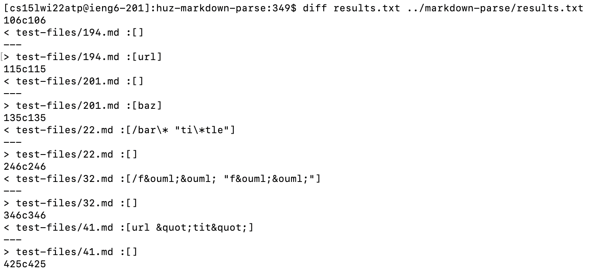
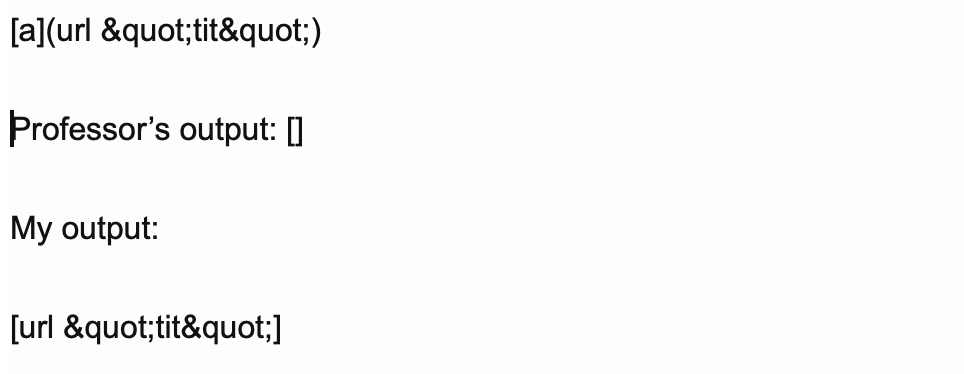
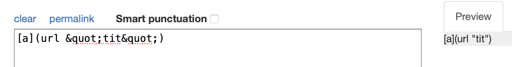
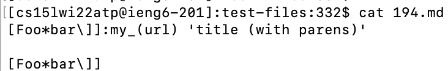
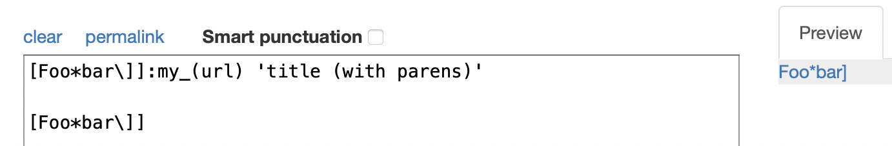
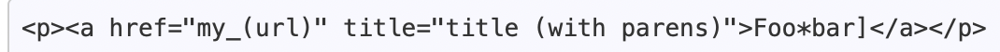
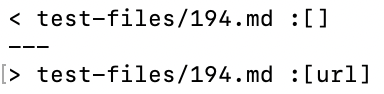
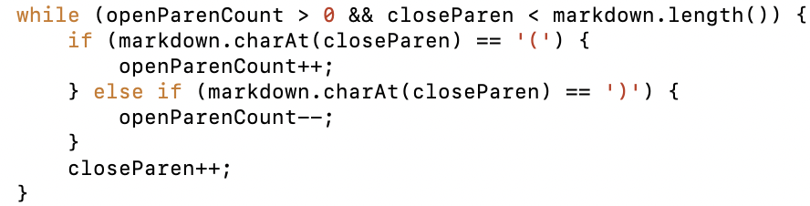

# Week 4 Lab Report

## Using ```diff``` to Find Differences

Here is the command I ran to find the ```diff```erences in the results.txt files generated from running the BASH script for the tests on my respository and the markdown-parse respository.



The output shown includes where the files have different output from the BASH script.

## Different Tests

For this lab report, I'm going to focus on test 41 and test 194.

1. Test 41.md

The test file contains the following text:



For this test, neither of the results are correct according to [commonmark](https://spec.commonmark.org/dingus/).

The expected result is 

However, I think in this case, Joe's markdown-parse makes the most sense anyways considering the output from commonmark seems like garbage.

The fix for this test is pretty quick. The professor's code just checks for blanks in between the parentheses and we can get a matching result if we add the same check in our code.

2. Test 194.md

The test file contains the following text:



For this test, neither of the results are correct according to [commonmark](https://spec.commonmark.org/dingus/).

The expected result is 

And the actual link is:



Here is the output of the diff results for this test:



According to these results, my code did not find a link and the professor's took "url" to be the link.

In this case, the professor's code outputs the expected result even though commonmark doesn't agree.

I think the fix for this is fairly simple. The responsible code in Joe's code is this while loop:



Essentially, we want to add the code to find the first pair of matching open and close parentheses. This can be done by including the above code in our method to find closeParen.